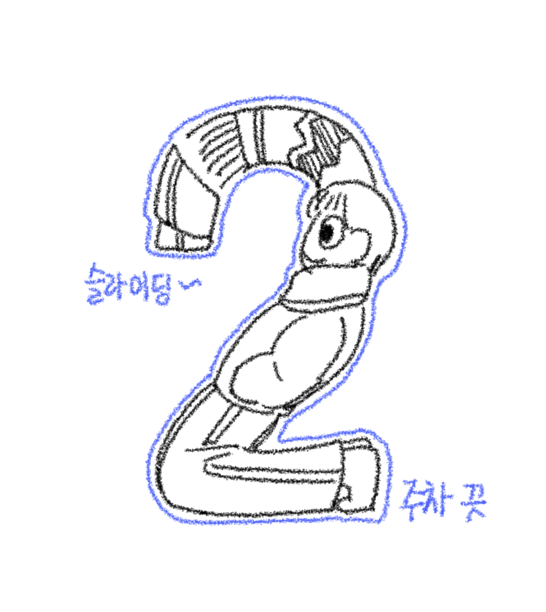
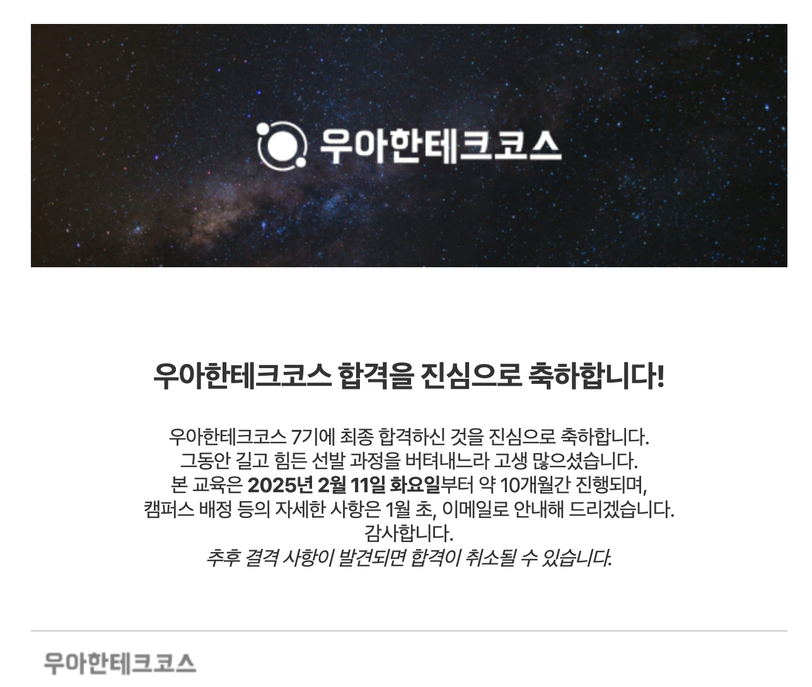

> 요약 <br/> > [ 우아한 테크코스 ] 7기 프론트엔드 최종 합격 과정 및 회고글입니다. <br/>
> 프리코스와 최종코테를 진행하며 겪었던 과정들과 생각을 정리했습니다. 이전 우테코 지원서 작성 부분의 다음 이야기를 다룹니다.

<br/><br/>

# 3. 프리코스

음 사실 프리코스를 하면서 다시금 프로그래밍을 좋아할 수 있게 되지 않았나 싶다. 우선 시작하기에 앞서 함께 스터디를 진행하며 많은 도움을 주었던 **대희**에게 고맙다는 말을 먼저 하고싶다. (갓대희!!)

총 4주차의 미션으로 이루어지는데 각 미션에 대한 구체적인 구현방법보단 어떤 생각을 가지고 코드를 구현한 것인지에 조금 더 중점을 두려고 한다.

<br/><br/>

## 1주차 : javascript-calculator

> [1️⃣ 1주차 레포](https://github.com/mun-kyeong/javascript-calculator-7/tree/mun-kyeong)
>
> [1️⃣ 1주차 PR](https://github.com/woowacourse-precourse/javascript-calculator-7/pull/159)

<br/>

**간략히**

---

1주차에선 MVC 패턴으로 미션을 구현했었다. 이유를 들어보자면.. 작년에 우테코 프론트를 했었던 친구가 MVC 패턴을 적용해서 미션을 구현했던 기억이 났기 때문..

화면 구성의 프로젝트 코드에 익숙해져있던 나에게 기능 위주의 JS 코드를 작성하는건 조금 낯설었었다. 어떤 방식으로 작성해야할지 감이 잘 오지 않았기에 그나마 친숙한 방법으로 접근하려 했던 것 같다.

그러나 PR 피드백에서도 반영되어 있는 부분이긴 하지만, MVC 패턴과 객체지향의 의미를 제대로 생각하지 않고 흐름만 생각하다보니 제대로 구현되지 못한 부분이 많았던 것 같다. 파일명과 폴더명의 통일도 제대로 되지 않아 아쉬운 부분이 많았던 첫 미션으로 기억에 남는다.

<br/>

**피드백**

---

1. **커밋 형식 통일**

- 첫번째 미션에서 좋았던 점은 우선 `커밋 형식 통일`이다. 미션 요구사항 중 커밋 형식을 통일하는 조건이 있었는데, **커밋 형식에 대해 조사하고 적용시키려는 노력**이 4주간의 미션에 많은 도움이 되었던 것 같다.

```markdown
<!-- 커밋 형식 -->

<type>(<scope>): <subject>

<body>

<footer>

<!-- 커밋 예시 (아래참고) -->

[FEAT] (Controller, Model) : 기본 구분자로 문자열 구분

- Controller에서 Model로 input값 전달
- Model에선 parseInt()을 통해 문자열 구분
- parseInt()는 현재 기본 구분자만 구분 가능

기본 구분자 기준으로 문자열을 파씽할 수 있도록 작성했습니다.
추후 기능 추가가 필요한 부분은 @todo를 통해 확인할 수 있습니다.
```

2. **구체적인 기능명세**

- 두번째로 좋았던 점은 **기능정의를 먼저 자세하게 진행**한 덕에 **코드 작성때엔 큰 무리 없이 작성가능**했던 점이다. 개인적인 생각이긴 하지만 기획이 정말정말 중요하다고 생각하기 때문에 코드 작성의 방향이 머릿속에 제대로 정리될 때 까지 구조를 세분화하려 노력했던 것 같다.

3. **JUnit test 사용**

- 다만, 아쉬웠던 점으로는 PR 리뷰를 내가 많이 진행하지 못했던 점과 **처음보는 JUnit test를 사용해보지 않고 바로 제출**해버린 점이다. 도전을 망설이지 말아야 한다고 늘 생각하지만, 새로운 환경에 적응하려고 마음먹는데 까지는 조금은 시간이 걸리는 것 같다. <br/> 미션지에서도 JUnit test를 활용해보라고 소개를 해주었지만 PR을 마무리하고 다른 사람들이 활용한 JUnit 코드를 보고 나서야 JUnit test를 소개해준 의도를 이해했던 것 같다.

<div style="text-align: center;">
  
</div>

<br/>

## 2주차 : javascript-racingcar

> [2️⃣ 2주차 레포](https://github.com/mun-kyeong/javascript-racingcar-7/tree/mun-kyeong)
>
> [2️⃣ 2주차 PR](https://github.com/woowacourse-precourse/javascript-racingcar-7/pull/59)

<br/>

**2주차 공부내용**

---

가장 PR을 많이 주고받고 가능한 구체적이게 동작시키려고 노력했던 첫 시도가 아닐까 싶다. 1주차의 경우 시험기간과 겹치는 바람에 신경쓰지 못한 부분들이 좀 있었는데 2주차부터는 조금 자유롭게 시간을 사용할 수 있어 좋았던 것 같다.

2주차 미션 구현을 위해 공부했던 내용들을 잠깐 정리해보자면

1.  **airbnb 코딩 컨벤션 정독**

    - 이전 프로젝트에서 쓰던 컨벤션 습관들이 남아있었지만 사실 컨벤션의 경우는 계속 보지 않으면 잊어버리게 되기 때문에... 다시한번 읽어볼 필요성을 느꼈고 상수 선언이라던가 `reduce` 반목문 사용 등 새롭게 알게 된 내용들도 많았다.

2.  **기능명세 방식 변경**

    - 각 기능명세 앞에 **태그(FEATURE/INPUT/OUTPUT)**를 붙여 기능을 구분했던 시도가 좋았던 것 같다. 또한 사용자의 입력으로 인해 파생되는 `기능 및 유효성 검사` 등을 하위 그룹 (1-A) 형식으로 구분해둔 점이 예외처리때도 많은 도움이 되었다.

3.  **유효성 처리 세분화**

    - 이전 1주차 피드백에서 유효성 검사를 구체적으로 작성하면 좋을 것 같단 피드백을 받았다. 사실 유효성 처리에 많은 신경을 쓰지 않았던 터라, 2주차 부턴 사용자의 입력을 프로그램이 **인식가능한 오차 범위 내**로 입력할 수 있도록 예외처리를 작성했다.

    - > 위에서 말한 **인식가능한 오차 범위 내** 라는 말은 띄워쓰기를 2번 한다던가, 혹은 마지막 단어가 나오지 않았는데 쉼표로 마무리를 했다던가 하는 등의 프로그램 내에서 수정가능한 범위를 말한다.

<br/>

**피드백**

---

피드백을 주고받은 내용이 참 많았어서 기억나는 몇가지만 적어두려 한다.

1. **`test.each()`**

   - 반복되는 테스트 코드의 경우 `test.each()` 함수를 통해 더 간결히 바꿀 수 있다.

2. **함수이름 명명 규칙**

   - 프로그래밍 요구사항 중 **함수는 하나의 기능만을 가지도록 작성하라** 라는 조건이 있었다. 내가 조금 약한 부분이기도 한데, 함수 이름을 지을 때 통일성 있게 지어야 할 필요가 있는 것 같다. 예를들자면 `boolean` 형식을 return 하는 경우엔 `is~`로 함수이름을 시작하고, `CarList` 보다는 `getCarList`와 같이 **동사**로 함수 이름을 시작하면 조금 더 전달력 있게 작성가능 할 것 같다.

3. **함수의 역할분리**

   - 특히나 class로 사용하다보면 너무 많은 역할이 class 안에 들어가는 경우가 많은 것 같다. 각 class에선 할당된 기능만을 담당할 수 있도록 줄이고 **output과 같은 다른 외부 기능들과는 분리**가 되어야 할 것 같다.

4. **javascript의 객체 지향 방식**

   - 사실 이건 아직도 헷갈리는 부분인 것 같다. 내가 자주 써온 프로그래밍 방식은 함수 중심의 절차프로그래밍 방식이였는데 이번 미션에서는 class와 new를 통해 객체지향방식으로 많이들 사용했었다. 스터디에서 얘기를 꺼내봤을땐 **javascript도 객체지향적이지만 다만 여기에 프로토타입이라는 독특한 시스템이 포함된게 아닐까** , 하는 얘기를 들었지만.. ~~사실 아직 잘 모르겠다..~~

5. **[ from 대희 ]**

   - 대희와의 코드에서 배운점을 조금 소개하려 한다. 대희의 경우 Input을 구조를 아래와 같이 사용했다.

   ```javascript

   //input.js
   const Input = (() => {
      class Input {
         #input;

         constructor(input) {
            this.#input = input;
         }
         ...

         static async readInput(msg) {
            ...
            return new Input(input);
         }

         parseCarNames(){}
         ...

      }

      return {
         readInput: Input.readInput
      };
   })();

   //index.js
   async getCars() {
      const input = await Input.readInput();
      const carNames = input.parseCarNames();
      ...
   }
   ```

   - 처음에는 이런 방식이 조금 생소해서 왜 이렇게 코드를 작성했는지 물어봤는데 대희는 Input의 역할을 제한하기 위해서 위와 같이 작성했다고 했다.
   - 예를들어보자면 대희가 생각한 Input은 사용자의 입력을 받고, 입력값을 해석하는 범위까지라고 생각을 했다고 한다. 그래서 개발자를 포함한 누군가가 `new Input("adsf")` 와 같은 방식으로 생성하게 된다면 사용자의 입력이 아닌, 개발자가 직접 값을 생성하는 형태가 되기 때문에 **Input의 객체를 생성하지 않기 위해** 위의 방식을 사용했다고 했다.
     <br/> 위의 방식은 `클로저 기법`을 사용한 것으로, static으로 선언한 함수를 먼저 호출하고 Input 클래스를 return 하는 방식으로 사용된 것이라고 생각하면 된다. (진짜 굉장한 방법이야..)

<div style="text-align: center;">
  
</div>

<br/>

## 3주차 : javascript-racingcar

> [3️⃣ 3주차 레포](https://github.com/mun-kyeong/javascript-lotto-7/tree/mun-kyeong)
>
> [3️⃣ 3주차 PR](https://github.com/woowacourse-precourse/javascript-lotto-7/pull/171)

<br/>

**3주차 공부한 내용**

---

확실히, 3주차쯤 되니 미션 난이도가 점점 올라가는게 느껴졌다. 요구사항도 더 많아지고 기능도 복잡해져서 공부에 투자해야 하는 시간이 꽤나 많아졌다.
1,2주차 피드백을 바탕으로 공부한 내용은 다음과 같다.

1. **JUnit test 작성**

   - 3주차만의 조금 다른 점을 뽑아보자면 JUnit test에 조금 더 힘써 작성한 점이다. 작은 기능 단위로 test를 진행하다 보니 **코드에 대한 신뢰도**가 높아졌다. 각각의 작은 기능 함수들이 제대로 동작되니 하나의 큰 단위의 함수를 만드는데 수월하게 진행되었던 것 같다. 또한 개발자가 신경써서 작성하려 하더라도 놓치게 되는 요구사항을 테스트를 통해 확인할 수 있어 **코드에 대한 정확도**도 높일 수 있었던 것 같다.

2. **객체를 생성하고 사용**

   - 사실 2주차에서 부터 눈치챘어야 하는 부분이였는데, (2주차에서) 사용자의 입력에 따라 필요한 자동차의 개수가 달라지는 문제였다. 동적으로 자동차 개수를 입력받아 자동차를 **생성**하는 개념으로 다가와 **new**를 통해 객체를 생성해야 하나? 라는 생각까지는 했지만 javascript에서 class를 사용한 적이 없어 조금 망설였던 부분인 것 같다. <br/> 3주차부터는 명시적으로 **객체를 만들고 이를 사용**하라는 조건이 있었기에 class 개념을 사용하여 미션을 해결했다. 조금 아쉬운 점이라고 한다면.. 상속이나 조금 더 객체지향적으로 class를 사용할 수 있었을 것 같은데 이 부분까지는 신경쓰지 못한 점이 조금 아쉽다.

<br/>

**피드백**

---

1. **class의 역할 분리**

   - `UserLottoInfo`라는 클래스가 정확히 어떤 것을 다루는지 알기 어렵다는 피드백을 받았다. `Info`라는 단어에 모든 걸 함축시킨 것 같은 느낌이 들고, 실제로도 class안에 많은 변수가 존재해서 수정이 필요할 것 같다는 피드백을 받았다. <br/> class의 역할을 분리하는건 늘 어려운 일인 것 같다. 초반에 계획했던 의도는 `UserLottoInfo`라는 클래스가 `Lotto`라는 객체를 이용할 수 있도록 만들고 싶었는데 너무 많은 역할을 부여하게 된 것 같다는 생각이 든다.

2. **변수명 통일**

   - 접두어를 공통으로 `print~()`를 갖는 함수들이 어떤건 반환값 없이 동작하고, 어떤건 반환값이 존재하는 건 통일성이 없다고 생각한다. 반환값이 존재하는 print 접두어를 갖는 함수명을 일관되게 수정하는게 좋을 것 같다. <br/>
     그리고 `is~()` 이렇게 시작하는 명칭은 보통 반환값이 boolean인 경우가 많다. 따라서 boolean 값을 반환하는 것이 아닌, 에러처리에 사용되는 함수라면 `throwErrorIfNotNumber` 와 같은 경우로 에러를 던진다는 표현이 있으면 더 좋을 것 같다.

3. **class의 변수 값 가져오기**
   - print 관련 함수가 class 내부의 모든 변수를 출력하는 느낌이 강하게 든다. 오히려 userLotto 내부에 출력하는 함수를 종속시킨다면 내부 변수를 꺼내는 get 함수들을 없앨 수 있어서 클래스 관점이랑도 잘 맞을 것 같다.

<div style="text-align: center;">
  
</div>

## 4주차 : javascript-convenience-store

> [4️⃣ 4주차 레포](https://github.com/mun-kyeong/javascript-convenience-store-7-mun-kyeong)

<br/>

4주차는 유일하게 미션을 마무리 하지 못한 미션이다. 굉장히 난이도가 높기도 했고, 이전과는 다르게 test 코드 작성 방법을 `TDD` 기법을 사용하여 작성해본 원인도 있는 것 같다.

4주차 미션을 진행하며 깨달은 점은 `TDD` 방식으로 코딩을 한다고 해서 기능 명세가 구체적이지 않아도 된다는 것은 전혀 아니였다는 점과,`TDD` 방식으로 코딩을 하게된다면 test 코드의 파라미터 전달 방식을 통일해야겠다. 라는 점이 기억에 남는다.

1. `TDD` 방식으로 코드를 작성했을 때 실수했던 점

   - 처음 TDD 방식을 도입하게 되었는데, TDD 방식이란, test 코드를 먼저 작성하고 해당 test를 통과하게끔 하는 프로덕션 코드를 작성하는 것이다. 다만, 해당 방식을 도입한다고 해서 구체적인 기능명세를 하지 않아도 되는건 아니였다는 점.. <br/> 기능 명세를 머리속에 정리를 다 하지 못한 채 작성을 시작해서 논리적인 흐름을 많이 가져가지 못했던 점이 아쉬움으로 남는다.

2. test 코드의 파라미터 형식을 통일하기
   - test 코드를 작성할 때 꼭 기억해야겠다고 생각된 부분이다. 바로 파라미터 형식을 통일하지 못한 점.. 즉, 어떤 test 코드의 함수에선 객체 형식으로 값을 받아오고 있었고, 어떤 test 코드에선 원시 타입 그 자체로 값을 받아오고 있어서 초반에는 어떤 문제가 생길지 잘 몰랐었다.
     <br/> 문제가 발생한건 각각 작은 단위의 함수들을 모아 하나의 기능을 하는 함수를 만들 때 서로 파라미터 전달 값이 다르니 **파라미터 형식을 통일**하는데 꽤나 많은 시간이 소요된 점이 아쉬웠다.

<br/>
<br/>

# 4. 코딩 테스트, 그리고 합격

이렇게 4주간의 미션을 진행하며 느꼈던 점을 간단히 요약하자면.. 우선 사람들과 소통하며 피드백을 주고받는 과정이 굉장히 좋았고, 내가 배울 수 있었던 점도 많아서 참 감사했던 것 같다.
그냥 미션을 완성하기 위한 코드가 아니라 **이유가 있는 코드**를 작성하려고 많이 노력했던 것 같고, 늘 **근거를 들어 얘기**할 수 있도록 연습했던 것이 많이 도움이 된 것 같다.

최종 코딩 테스트 관련해선 사실 나의 경우 시간이 너무나도 부족했다. 학교 기말고사 3일 전에 서울로 올라가서 시험을 치고 내려와야 하는 상황이였기 때문에 사실 코딩 테스트를 준비하는 시간 보다 학교 기말고사 준비 시간이 더 급했었고,, 실제로 코딩 테스트 당일날 오전 7시부터 오후 1시까지 **미션 구현의 감**을 다시 살리기 위해 2주차 미션을 새로 만들어봤다는 점 밖에 없어서...

다만 그때 나의 생각을 풀어보자면, 작년, 제작년 문제를 풀어간다 하더라도 문제 해결의 형식은 크게 달라지는 것이 아니라고 생각했었고, 문제를 외워서 푸는 방식이 아니였기 때문에 **프리코스때 겪었던 경험을 다시 되살리는**일이 더 중요하다고 생각이 되었던 것 같다. 실제로도 그럴 수 밖에 없기도 했고.

그리고 결과는,, 정말 감사하게도



합격했습니다 ㅠㅠ 참 부족한 시간과 나였음에도 불구하고 끝까지 포기하지 않게 도와준 주변 사람들과, 흥미를 잃지 않고 끝까지 함께 해준 대희에게도 참 고맙습니다. 이런 기회를 허락해주신 하나님께도 정말 감사했고, 조금 늦은 후기이긴 하지만 그럼에도 소식 듣고 축하해준 모든 사람들에게 다시한번 고맙다는 인사를 남깁니다.

조금씩 더 성장해서 올테니 많이 기대해주세요. 감사하고 또 고맙습니다 :)

<br/>
