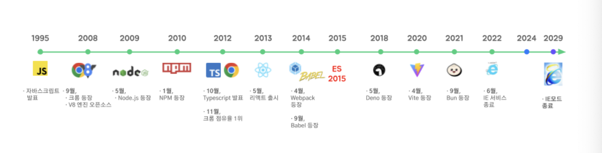

> 요약
> 우테코 1단계 3주차 - TS에 대한 내용을 다룹니다.
> TypeScript를 사용하게 된 이유와 필요성을 정리한 글입니다.

<br/>
<br/>

---

## TypeScript

---

**목차**

- [TypeScript](#typescript)
  - [TypeScript에 대해 공부하게 된 배경](#typescript에-대해-공부하게-된-배경)
  - [TypeScript의 등장 배경](#typescript의-등장-배경)
    - [JavaScript의 한계](#javascript의-한계)
  - [정적 타입 시스템의 이해](#정적-타입-시스템의-이해)
    - [타입이 뭐예요~ (동적 타입 / 정적 타입)](#타입이-뭐예요-동적-타입--정적-타입)
  - [TypeScript의 철학](#typescript의-철학)
    - [구조적 타이핑](#구조적-타이핑)
    - [점진적 도입](#점진적-도입)
    - [JavaScript와의 완벽한 호환성](#javascript와의-완벽한-호환성)
    - [컴파일 시간 검사, 런타임 영향 없음](#컴파일-시간-검사-런타임-영향-없음)
  - [TypeScript - 생각해보기](#typescript---생각해보기)

---

<br/>
<br/>

### TypeScript에 대해 공부하게 된 배경

레벨 인터뷰에서 TypeScript를 왜 사용하는 것 같냐는 질문에 "타입이 자유로운 JS를 보완하는 도구"라고만 대답했더니, 컴파일 타임과 런타임에 대한 언급이 있었으면 좋았을 거라는 피드백을 받게 되었다.

이 피드백을 통해 TS를 사용하는 이유에 대해 깊이 생각해보지 않았다는 것을 깨닫고, TypeScript를 제대로 배워보고 싶다는 생각이 들었다.

<br/>
<br/>

### TypeScript의 등장 배경

#### JavaScript의 한계



TS의 등장 배경을 이해하기 위해선 JavaScript의 등장 배경을 같이 이해하면 좋을 것 같다. 처음 JS가 만들어졌을 당시엔 웹 페이지의 간단한 상호작용을 위해 만들어졌다. 폼 검사라던가 혹은 간단한 애니메이션을 만들기 위한 기능에 불과했었다.

다만 2000년대 웹은 급격한 변화를 겪으며 이에 따라 JavaScript의 사용률 또한 급격하게 올라가게 되었다. 그리고 이때 JavaScript의 유연성을 제공하기 위한 **동적 타입 특성**이 더 많은 문제를 가져오게 된다.

런타임 오류를 빈번히 발생시킨다거나 코드 탐색과 리팩토링을 어렵게 하는 문제들을 맞이하게 된 것이다.

<br/>
<br/>

### 정적 타입 시스템의 이해

#### 타입이 뭐예요~ (동적 타입 / 정적 타입)

프로그램에서 **타입**이란 값의 **종류**와 그 값에 수행할 수 있는 **연산**을 정의한다.

**동적 타입 시스템**

동적 타입 시스템은 변수의 타입이 **런타임(프로그램이 실행되는 시점)**에 결정된다. 따라서 타입오류가 **런타임**에 발견된다.
같은 변수에 **다른 타입의 값을 할당**할 수 있다.

유연성과 빠른 프로토타이핑을 지원하지만 **런타임 잠재 오류 가능성**을 여전히 가지고 있으며 **IDE 지원이 제한적**이다는 단점을 가진다.

**정적 타입 시스템**

변수의 타입이 **컴파일 시점(프로그램 실행 전)**에 결정된다. 따라서 타입 오류가 **컴파일 시간**에 발견된다.
변수는 선언된 타입의 값만 가질 수 있다.

**컴파일 시간에 오류를 발견**할 수 있으므로 더 안전한 리팩토링이 가능하며 **IDE 지원과 코드 탐색**이 가능하다. 하지만 **더 많은 선행 설계**가 필요하며 때로는 **유연성을 제한**하기도 한다.

> 정적 타입 : (JavaScript, Python, Ruby) <br/>
> 동적 타입 : (Java, C++, Rust)

<br/>
<br/>

### TypeScript의 철학

#### 구조적 타이핑

TypeScirpt는 이름이 아닌 **구조**에 기반한 타입 시스템을 사용한다. 이는 JavaScript의 덕 타이핑(duck typing) 특성과 일치한다.

>  > <br/>
> 덕 타이핑 특성이란 " 어떤 객체가 오리처럼 행동한다면, 그 객체를 오리라고 취급한다"는 뜻입니다.

<br/>

#### 점진적 도입

기존 JS코드를 한번에 TS로 전환할 필요 없이 파일 단위로 점진적으로 도입 가능하다.

<br/>

#### JavaScript와의 완벽한 호환성

TypeScript는 JavaScript의 상위집합으로 설계됨. 즉, 모든 유요한 JS 코드가 TS 코드로도 유효하다는 의미이다.

또한 JS 생태계의 라이브러리와 도구를 그대로 활용할 수 있다.

<br/>

#### 컴파일 시간 검사, 런타임 영향 없음

TypeScript 컴파일러 `tsc`는 TS 코드를 JS로 변한해준다. 이 과정에서 Type 정보는 제거되며 출력된 JS 코드는 어떤 런타임에서도 실행될 수 있다.

```javascript
// TS 코드

function greet(name: string): string {
  return `Hello, ${name}!`;
}

// 컴파일 과정을 거쳐 타입이 완전히 제거됨
function greet(name) {
  return `Hello, ${name}!`;
}
```

결론 : TS는 개발 단게에서만 사용되는 도구이다!!

<br/>
<br/>

### TypeScript - 생각해보기

1. JavaScript의 동적 타입이 가진 유연성의 장점은 무엇이며, 어떤 상황에서 여전히 가치가 있을까?

**동적 타입**은 같은 변수에 **다른 타입의 값을 할당**할 수 있다.
따라서 **코드 작성 속도**와 **유연한 데이터 처리**에 유리하다.

2. TypeScript가 100% JavaScript 호환성을 유지하는 것의 의미와 중요성은 무엇일까?

모든 JS 코드는 TS가 될 수 있다는 것을 의미하며 기존 JS 코드가 그대로 동작할 수 있음을 의미한다.
따라서 점진적으로 조금씩 TS로 코드 변경이 가능하며 기존 자산을 활용할 수 있다는 장점이 있다.

3. 타입 시스템이 코드 품질과 개발자 경험에 미치는 영향은 무엇인가?

컴파일 단계에서 오류를 잡아내므로 안정적이게 코드를 작성할 수 있다. 또한 타입이 일관성있어지므로 유지보수가 쉬워진다.
또한 타입 시스템은 개발자가 실수하지 않도록 도와주고, 자동완성과 빠른 피드백으로 개발 경험을 향상시켜준다.

4. 왜 많은 오픈 소스 프로젝트와 기업들이 TypeScript를 채택하게 되었을까?
   타입 이론의 관점에서 TypeScript의 타입 시스템은 어떤 한계를 가지고 있을까?

정적 타입 덕분에 코드의 안전성과 유지보수성이 향상되며 대규모 협업과 리팩토링에 유리하기 때문이다.
하지만 TS는 컴파일 시 타입 검사만 수행하기 때문에 런타임 타입 안전성을 보장하지 않는다. 또한 완전한 타입이 아닌 구조가 같다면 같은 타입으로 인정하기 때문에 (덕 타이핑) 복잡한 타입 추론에 있어서는 불완전하거나 허용적인 설계를 택하기도 한다.

5. TS를 사용했을 때, jsdoc과 같은 도구를 사용해 문서화하는 것과 어떻게 다를까?

TS는 타입 정보를 **코드에 직접 포함**하므로 별도의 주석 없이도 문서화와 자동환성이 자연스럽게 이루어진다. jsdoc은 주석 기반이라 개발자의 추가 관리가 필요하다.
