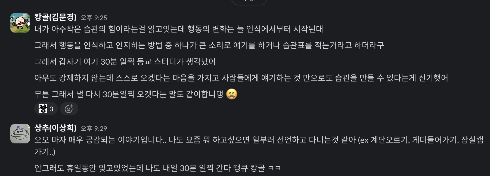
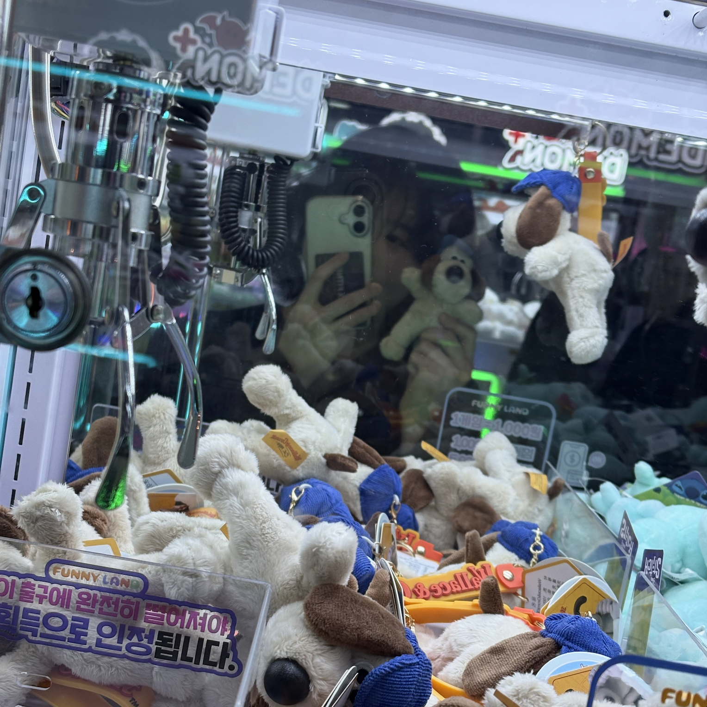
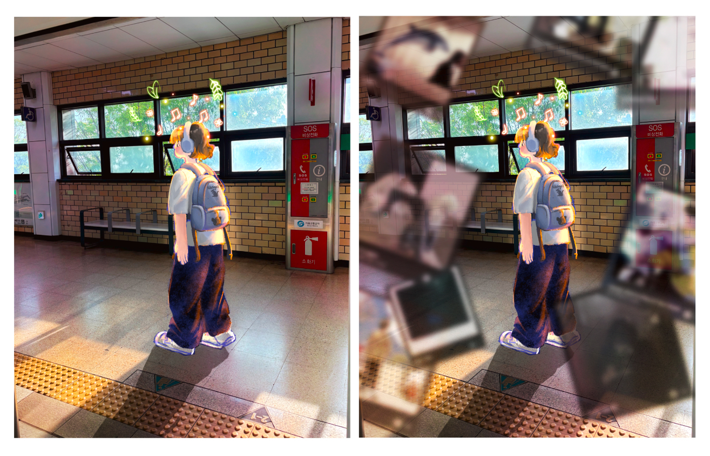

> 요약
>   2025년도 5월 첫째주 회고 글입니다.
> 이번주 동안에 들었던 생각들을 정리합니다.

 

## 행복하시나요?

(25.4.30)

행복을 다시 의식적으로 찾아야 할 것 같다는 생각이 들었다.

나는 원래 정말 쉽게 행복에 전염되는 사람인데 요새 행복했던 순간들이 잘 떠오르지 않는다.

환경의 변화인지, 내면의 변화인지는 잘 모르겠지만.. 내가 오래 버틸 수 없는 감정에 머물고 있는 것 같아서 불안하다

감사일기를 다시 적어볼까 하는 생각도 든다. 의식적으로 행복을 찾고, 또 감사하는 날들이 많아졌으면 좋겠다.

 

## 아주 작은 습관의 힘

이번주는 새로운 목표가 생겼다. "의식적으로 행복하기 위해서 노력하기"

하루 10분 독서 스터디를 하면서 요새 "아주 작은 습관의 힘" 이라는 책을 읽고있다.

사실 무슨 책을 읽어야 할질 모르겠어서 아무거나 집은 책이였는데 지금의 나에게 꽤나 필요한 태도를 배울 수 있었다.

---

습관은 **어떤 사람이 되는 것**이다.

궁극적으로 습관은 내가 되고 싶어 하는 사람이 될 수 있도록 돕는다는 점에서 중요하다.

...

변화를 지속하기 위해서는 **정체성 중심**의 습관을 세워야 한다.

자신의 정체성에 맞는 일은 하기 쉽기 때문이다.

즉, 목표는 '책을 읽는 것'이 아니라 '독서가'가 되는 것이다.

나는 이런 것을 '원하는 사람'이야 라고 말하는 것은** 나는 '이런 사람'이야 **라고 말하는 것과 다르다.

...

이런 측변에서 습관은 정체성을 만들어나가는 것이다.

매일 침구를 정돈한다면 나는 체계적인 인간이라는 정체성을 만드는 것이다.

나를 변화시키는 두 가지 방법이 있다.

1. 어떤 사람이 되고 싶은지 결정한다
2. 작은 성공들로 스스로에게 증명한다

...

습관이 형성되고 나면 자동적, 무의식적으로 행위가 일어난다. 무슨일이 일어나고 있는지 미처 깨닫기 전에 과거의 패턴대로 행동하는 것이다

그렇기 때문에 우리는 의식적으로 행동 변화 과정을 시작해야한다

확인하고 외치는 시스템은 무의식적인 습관을 의식적인 수준으로 (인지 수준을) 끌어올리기 때문에 매우 효율적이다

행동의 변화는 늘 인식에서 시작된다. 큰 소리로 말하거나 습관 점수표를 작성하는 것 같은 전략은 자신의 습관을 알게 해준다

---

 

책을 다 읽고 난 후 아침 30분 등교 스터디가 생각났다.

사실 우리는 스터디 형식 이라기보단 소모임에 더 가깝다

어떠한 형태의 규칙이나 벌금이 없기 때문에 그 누구도 강제하지 않는 상황이랄까

하지만 서로가 일찍 오겠다는 다짐만으로 거의 2주 넘게 잘 시행되고 있다

의식적으로 어떤 행동을 하고, 주변 사람들에게 알리는 행위만으로도 그게 습관으로 자리잡을 수 있다는 사실이 신기했다.

 

## 이번주 행복했던 일

이번주는 행복했던 순간들이 꽤나 기억에 남는다

**영어 회화 이야기**

---

일단 시간순대로 정렬해보자면, 이번주 화요일 영어 회화 스터디를 시작했다.

처음에는 '한글도 어려운데 영어로 어떻게 대화를 해?' 하는 생각이 있었는데 막상 영어로 대화하다보니 굉장히 재밌게 느껴졌다.

클레어랑도 굉장히 친해졌다. 클레어랑 첫 대화 파트너였는데 굉장히 기억에 남는 대사(?)가 있다 ㅋㅋㅋ

좋아하는 음식이 있는지에 대해 서로 답변을 주고받던 중 **소금빵**을 좋아한다는 말을 하고싶었는데 소금빵이 영어로 뭐지? 싶었다

그래서 대충 직역해서 "salt bread!"이라고 외쳤는데 클레어가 '그게 뭔데?'하는 표정으로 나를 쳐다봤다 ㅋㅋㅋ

그래서 생김새를 묘사하기 위해 "it's looks like a croissant" 이라고 말하니까 클레어가 'oh, salt bread!!! I know salt brad!!" 이라고 공감해줘서 엄청 웃겼다 ㅋㅋㅋ

그리고 모찌였나? 영화 뭐좋아하는지 물어보는 답변에서 진격의 거인을 말하고 싶었나봐

"walking giant!!" 처음엔 이해 못했는데 그냥 이름이 진짜로 giant 이야기라고 하길래 그게 뭔가,,, 싶었다가 '진격의 거인' 생각이 들자마자 엄청 웃었다 ㅋㅋㅋ

walking giant 말고 진격의 거인을 어떻게 더 잘 설명하냐구 ㅋㅋㅋㅋ

> 지금보니 소금빵은 진짜 salt bread이고 진격의 거인은 Attack Titan 이라고 한다 ㅋㅋ

 

**성수동 동네한바퀴**

---

그리고 태호오빠랑 선재가 서울에 놀러왔다

놀러온다고 햇을땐 그냥 오랜만에 같이 밥묵어야지~~ 요런 생각이였는데 막상 얼굴보자마자 너무 신나서 엄청 왕왕 거렸다

SFC 사람들은 언제봐도 그냥 그 자리에 있어줄 것 같은 느낌이 많이든다

사실 만나서 뭘하고 어떻게 놀았는지는 다 생각나진 않는데 그냥 같이 있는 시간이 너무 재밌엇고 행복했다

그냥 지나가다가 들른 퍼퓸 샵에서 아빠한테 줄 아로마 탈취제(?)를 샀고 지나가다 들른 인형뽑기 샵에서 원트만에!!! 강아지 인형을 뽑았다

그리고 또 지나가는길에 왕창 큰 에그타르트 2개를 샀고 지나가는 길에 들른 디올 건물 앞에서 사진도 찍었다

뭐 보면 알겟지만 진짜 아무 계획없이 놀러갔다 ㅋㅋㅋㅋ 발닿는대로, 가고싶은대로 걸었는데 그냥 너무 좋았다

계속 보고 싶은 사람들이다 나한텐

둘다 행복했으면 좋겠다. 너무 행복해서 맨날 웃고 다녔으면 좋겠다

 

**엄빠가 너무좋아**

---

본가가 최고다. 이번주에 연휴가 좀 길어서 본가에 내려갔다 왔는데 집이 정말 최고다

그냥 아무것도 안해도 거실에 누워만 있어도 마음이 너무 편했다

괜히 엄마한테 칭얼(?)거리기도 해보고 동생도 오랜만에 집에 와서 꽤나 귀찮게 괴롭혔다 ㅎㅎ (애정표정이지 ㅎㅎ)

나 서울로 올라가야 하는 날엔 엄마가 오므라이스를 해줬는데 아빠껀 지그재그, 내껀 하트로 케챱을 뿌려줘서 아빠 보기전에 얼른 다 먹었다

아빠 서운해할것 같았어 ㅋㅋㅋㅋㅋ

엄만 날 너무 조아해

어렸을땐 몰랐는데 커서보니 아빠같은 남편 없는 것 같다

동생도 신앙을 잃지 않고 올곧게 잘 자라줘서 고맙다

아무튼 집이 최고.

 

이번주 그렸던 그림으로 마무리

