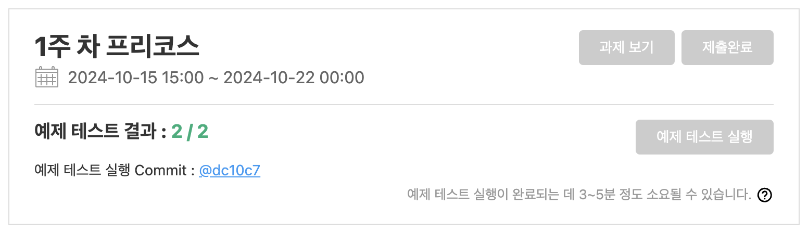
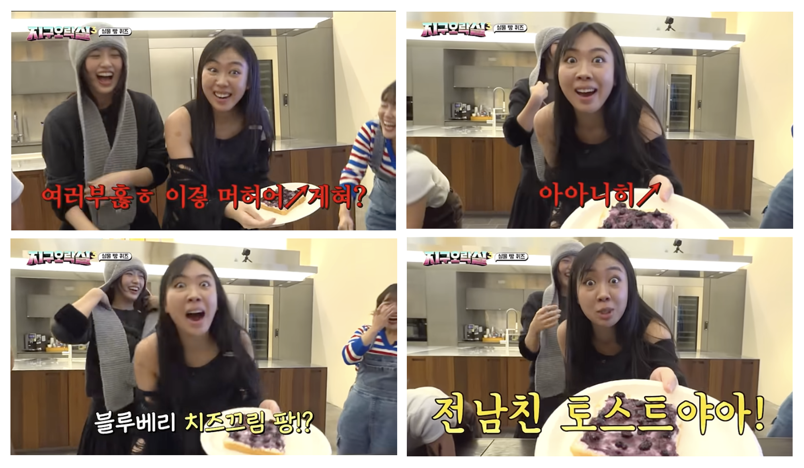
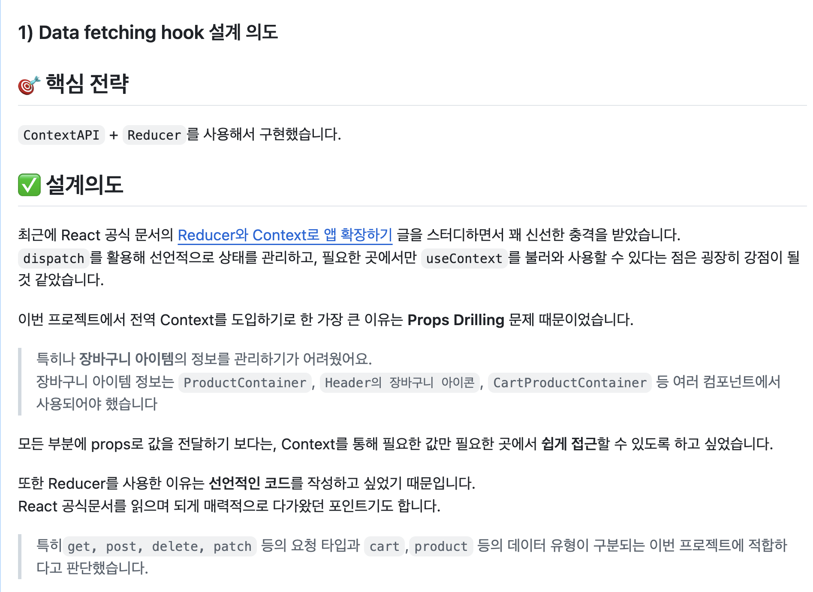
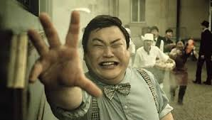
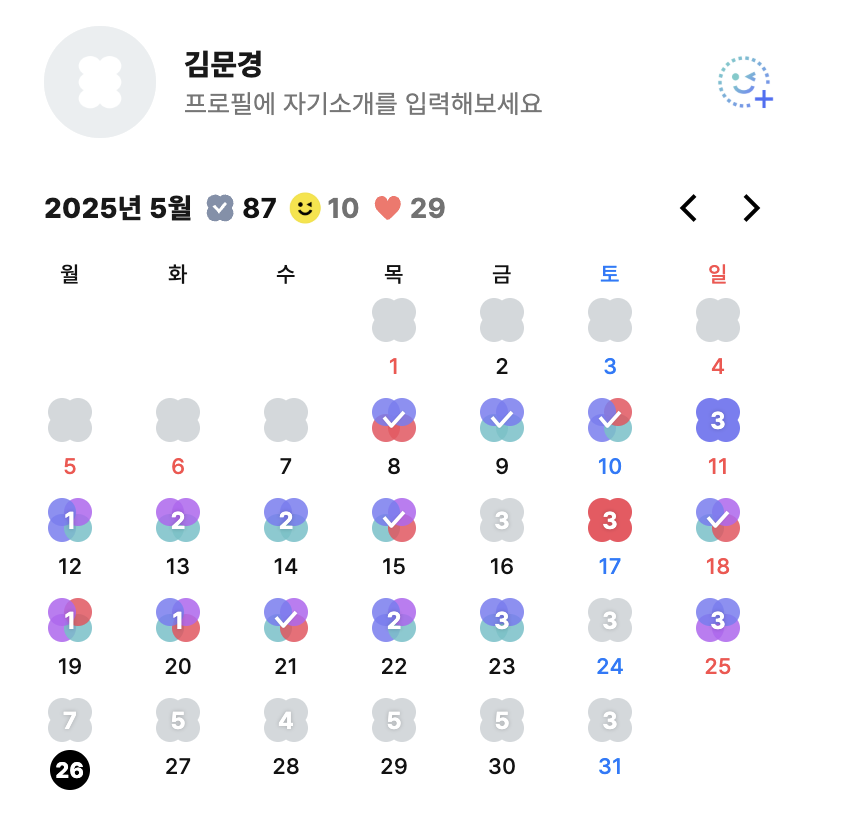
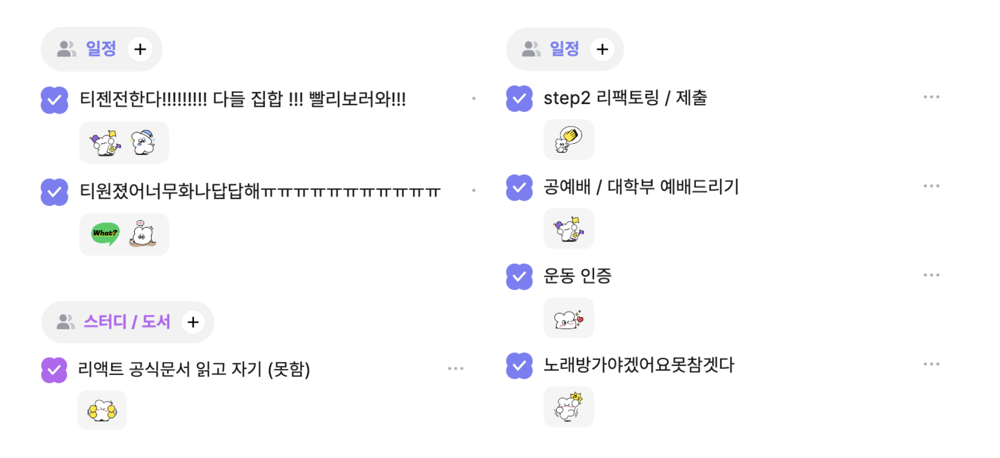
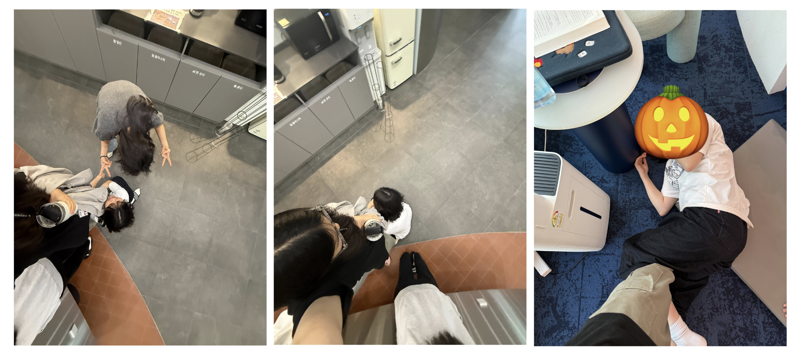
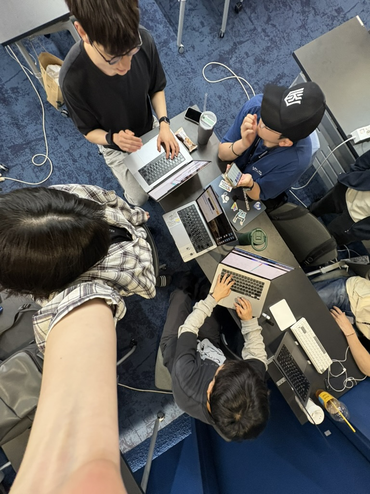
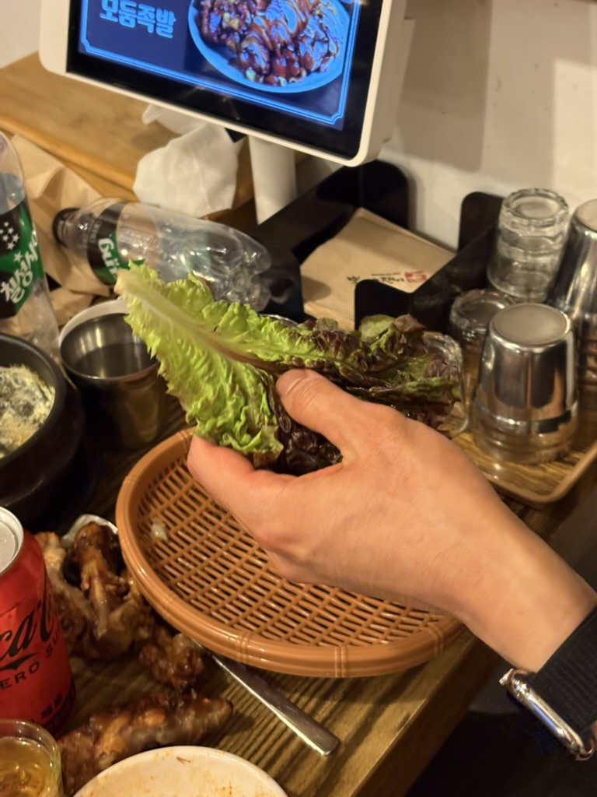

> 요약
>   2025년도 5월 넷째주 회고 글입니다.
> 약 3주.. 동안의 주간 회고 글입니다

 

---

**목차**

- 
- [🎵 오늘의 음악](#-오늘의-음악)
- [📢 근황 Talk](#-근황-talk)
- [📋 TODO mate 친구가 되어봐요~](#-todo-mate-친구가-되어봐요)
- [☘️ 행복(이라 읽고 웃겼던)했던 작은 일들](#️-행복이라-읽고-웃겼던했던-작은-일들)

 

## 🎵 오늘의 음악

최근에 빠진 음악을 소개합니다~

> **These Tears** - [ Andy Grammer ]

> These tears mean I'm lettin' you go  
> 이 눈물은 당신을 보내준다는 의미예요
>
> I'm learnin' how to be alone  
> 혼자서도 잘 지내는 법을 배우고 있어요
>
> I'm broken, but give it time  
> 몸과 마음이 다 망가졌지만, 시간이 지나면
>
> I'm gon' be alright  
> 괜찮아질 거예요

 

**어쩌다 좋아하게 됬나면요~**

카페에서 공부하고 있었는데 갑자기 가사가 귀에 들렸다.

어디서 많이 들어본 노래였는데 제목을 몰라서 한시간을 노래를 찾았다... ㅎㅎ

그렇게 찾은 노래를 듣다보니 갑자기 부산이 너무 그리워졌다.

내가 좋아하는 공간들이 많이 떠올랐다. 내 자취방에, 정문에서 집으로 가던 길 골목들, 비가 많이 올때면 카페 그라운드에서 공부하던 순간들

서늘한 밤공기가 기분이 좋았고, 거기서 마두치던 사람들은 내가 모두 사랑하는 사람들 뿐이였어

회복하는데 시간이 많이 걸렸고, 지금은 정말 많이 괜찮아졌지만!! 여름의 향기와 그 사람들의 흔적은 나를 너무 쉽게 녹여내린다

슬픈건 아니고, 행복한 흔적인거다.

 

## 📢 근황 Talk

나.. 꽤나 열심히 살고있다. 정말로 ...

음 먼가 양이 많아질 것 같아서 간략히 정리만 해보자면

**1️⃣ 영어 화화 스터디**

---

갑자기 웬 영어냐 하겠지만 꽤나 재밌다

특히 클레어랑 영어 회화 스터디를 하면서 친해졌는데 같이 영어로 얘기하면서 많이 웃었다.

진격의 거인은 영어로 뭐게요~

walking giant?

아아니~~

"Attack on Titan"~

(영지처럼 외치면서 ... )

 

**2️⃣ 리액트 스터디**

---

리액트 공식문서를 열심히 읽고있다!!

평소 내게 부족하다고 생각드는 부분이 기본 배경지식이였는데 그걸 딱! 채워는 스터디라고 생각된다.

수업 진도랑 비슷하게 공식문서를 읽고 있어서 공식문서에서 배웠던 내용을 미션에 적용해볼 수 있는 경우가 많아서 좋은 것 같다.

실제로도 이번 장바구니 step2에서 리액트 공식문서에서 읽었던 내용을 바탕으로 ContextApi + Reducer를 사용한 상태관리를 해봤다!!

다만 이제 조금 두려워지는건 배경지식이 많아질수록 그게 나를 더 갇힌 사고로 만들까봐 조금 걱정된다.

다른 방면에서 사고하지 않고 공식문서에서 이렇게 얘기하니까 이렇게 구현하는게 맞지 않을까! 하는 편협적인 사고를 하게 될까봐 조금 우려되는 부분이 있다.

늘 열려있는 태도로 의견을 수용할것.

협업은 **이기려는 생각**으로는 도움이 되지 않는다. 상대방의 의견을 존중하고, 또 필요할땐 비판적으로 받아들일 수 있게 노력해야겠다.

 

**3️⃣ PR리뷰 스터디**

---

진짜 뭐 많이 하네 ,,,

미션 2부터 PR 리뷰 스터디에 들어가게 되었다.

같은 미션이 주어졌을 때 다른 사람들은 어떻게 사고하고 구현했는지 궁금해서 시작하게 되었다.

사실 리뷰 스터디를 하면서 리뷰어들이 얼마나 많이 노력하고 계셨는지 알게 됐다 ..

남의 코드를 읽고 이해하는 것 만큼 힘든 일이 없다.. (그런 의미에서 리뷰어들은 진짜 대단한 것 같다)

하지만 스터디를 통해 내가 놓치고 있던 부분, 같은 미션에 대해서 서로 다른 견해를 알 수 있어서 공부가 많이 된다.

아 근데 이거 배운 내용을 바로바로 정리 안하니까 금방 까먹는다 .. 비상 ....

 

?? : 스터디 괜찮나요?

?? : 네 재밌어요. 배울점이 많아요

?? : 스터디를 통해 뭘 배웠나요?

?? : 아뇨 그냥 재밌어요. 유익해요 ^^ <- 메모리 초기화 된 나..

조만간 리뷰 스터디를 통해 배운것도 정리.. 해볼께요 네.

 

**4️⃣ + a ..**

위에 언급한 것들은 큰 조각 단위로 말한거고 작은 활동들도 굉장히 많이 한다.

- 아침 30분 일찍 등교하기 스터디 (근데 내가 잘 못하고 있음 ..)
- 피터네 유강스 (늘 새로운 목표를 세울 수 있게 도와줌)
  - 매일 아침 등교하면서 하루 묵상 듣기
  - 주 3회 운동
  - 회고 ...
- 하루 10분 책 읽기 (책 바꾼다고 한 4일정도 안한듯 ..)
- 아침 10분 영어로 말하기 with 퐁쥬, 헬리
- 나만의 캐릭터 찾기 워크숍 - 근데 이제 시작함!
- 오운완 스터디 1기 (이거 덕분에 운동 매주 가는듯)
- 뭐 또 있을텐데 기억은 잘 안난다 .. ^^

 

거 가지마쇼.. 내가 얼마나 바쁜지를 좀 들어봐

그래서 일주일이 어떻게 가냐면

1. n개의 스터디준비 + 미션중 (페어기간은 진짜 지옥임 개바빠)
2. n개의 스터디 준비 + 미션 제출 완료 (절대 못쉬쥬?)
3. m개의 스터디 완료 + n개의 스터디 준비 + 미션 (자체) 휴식
4. n개의 스터디 완료 + 미션 시작 (뭐? 이틀 뒤 제출이라고?)

이거 무한반복중 ㅋㅋ
정신없어요 요즘 (롤체도 많이 몬해 ,,)

 

## 📋 TODO mate 친구가 되어봐요~

사실 다른 크루들이 todo mate를 한다는 얘기를 들었을 때 친추만 하고 todo mate를 시작해야겠단 생각을 잘 안했던 것 같다.

계획을 세우는게 재밌는 사람도 있겠지만, 나에게 있어서 계획이란 앞으로 기억해야 할 무언가의 짐처럼 느껴진다.

그래서 계획을 자세히 세울수록 그 계획 속에 갇혀버려서 되려 실천하지 못했을 때 스트레스를 더 받는 편이라 그냥 아예 세우지 말자!! 라는 생각을 가지고 있었던 것 같다

 

그러던 내가 todo mate를 하게 된 이유는 단순히도 ,, 사람들이 일정을 완료할 때 마다 알림이 오는데 그게 굉장히 자극이 된다.

나는 아직도 누워있는데 이사람은 과제를 다 했네! 스터디 준비를 다 했네! 하면서 몸을 일으켜 세우는 동기부여가 된달까

그래서 나도 투두메이트를 통해 소통을 하고싶다, 다른 사람들에게 좋은 영향을 끼치고 싶다. 라는 생각에서 시작하게 되었다.

내 투두메이트가 조금 웃긴이유도 난 일정 정리용이라기보단, 그냥 **같이 투두메이트 하는 사람들에게 전하는 메시지** 정도로만 생각중이다 ㅋㅋㅋ

매일마다 꾸준히 하려는 습관들도 체크하고, 매일 행복했던 기억들을 기록할겸 해서.

계획의 강박에서 벗어나 일정을 관리하고, 일정의 자유도를 높이니 꽤나 재밌다 이거 ㅎㅎ

 

## ☘️ 행복(이라 읽고 웃겼던)했던 작은 일들

**✔️ MBTI 논쟁**

한때 ENFP로 살아가던 내가 어째서 ISFJ가 되었냐 함은.. 많이 지쳤던 것 같다.

사회화를 거쳐 기세가 많이 꺾였달까 ..

학생회를 하고, 학년이 높아질수록 가볍게 생각해선 안되는 일들이 많아졌다.

나를 드러내기보다 나를 감춰야 하는 일들이 더 많았고, 나서서 뭔갈 시도하기보단 안정적인 위치에서 서포트 해주는 일을 더 선호했다.

특히나 후배들을 더 알게 될수록 어리광을 부릴수는 없었고, 조교라는 사회적인 위치와 선배로서의 역할도 다 감당해야 했었다,

그러다보니 최소한의 액션으로 나를 드러내기에 좋은 방향으로 MBTI가 바뀌게 된 것 같기도

 

근데 여기선 다들 나를 막내취급을 해주다보니 MBTI가 다시 태초로 돌아가고 있는 느낌 ㅋㅋㅋㅋ

행복을 다시 찾게 되면서 내가 감춰진 ISFJ로 살기보다, 온전히 순간의 행복을 누릴 수 있는 ENFP가 점점 더 좋아지기 시작했다.

한순간에 성격이 바뀔 순 없겠지만 적어도 16조 엉이야들한테 만큼은 어리광 다 부릴꺼다

 

**✔️ 엘리베이터에서 만난 은인**

이날도 넘 지쳐서 .. 밖에 나갓다 들어오는 길이였따

엘베에 같이 엘리베이터 수리 기사님께서 같이 타셨는데 내가 13층 누르는거 보고 우테코 수강생인걸 알앗나봐

수리 아조씨가 갑자기 "코딩 할만해요?"라고 물어보시길래 살짝 놀랬지만 좀 지쳐있던 상황이라 고개를 절래절래 했다 🫨

(유독 그런 날 있자나.. 그냥 좀 지치는날 ..)

그러더니 아조씨가

"원래 배울때가 제일 힘든거고 돌아보면 제일 재밌는 순간이예요. 이미 모든걸 다 알고있으면 재미없어서 그러지. 힘들다는건 배우고 있는거예요. 잘하고 있어요"

이렇게 얘기해줘서 조금 지치던 하루에 의미가 생겼다

나는 배우고 있는 중이라서 그렇구나,

아주 조금 지칠때면 나는 배우고 있어서 그런거라고 생각하기로 했다 📚

 

**✔️ 금쪽이가 되**

그냥 기분이 좋았다!

사람이 좋다. 맨날 보고싶다

엉니들 + 쌍추를 조아하는 이유는 내가 당신들을 좋아하는걸 다들 너무 잘 안다.

앵기면 잘 받아준다

내사랑을 감당해봐.

 

**✔️ 왼온원**

메타랑 퇴근하기 전에 망고 나눠먹었따!! 그래서 행복햇다

근데 나랑 메타랑 둘이서 망고 가지고 싸름하는거 보더니 지나가던 준이 예쁘게 망고 잘라주고 사라졌다

우렁총각 준 ...

왼온원도 의미있는 일들이 많았다.

내 고민점을 요약하자면 '무엇을 목표로 잡아야 할지 모르겠다' 라는 부분과 '우테코가 끝나고 나서 이건 내가 성장햇어!! 라고 말할 수 잇을만한 부분을 잘 모르겠다' 라는 부분이다.

왼손이 해준 말 중에 가장 기억에 남는게

"캉골의 말을 들어보니 조금씩 성장하고 있는게 느껴진다. 그래서 재료는 충분히 준비되어 있는데 어떤 요리를 해야할지를 정하지 못해서 요리를 못하고 있는 것 같다"

라는 말이 굉장히 인상깊었다.

나는 무슨 요리를 만들어서 사람들에게 대접하고 싶은걸까?

 

**✔️ LCK 출발**

컴공의 장점 : 티켓팅 할때 빠르다 <- 절대아님 ㅋㅋ

근데 우디가 진짜 레전드다 (positive)

lck 티켓팅을 금,토 일정 다해줬다 ....

심지어 토요일은 티원이라서 티켓팅 진짜 빡셌을텐데 진자 어떻게 A 열 앞자리를 잡은거지?

말이안된다

우디 최고.........................

나의 lck 여정에 함께해준 너무 다정한 사람들

옹기종기 모여서 다같이 lck 티켓팅 해줬다 ㅋㅋㅋ 재밋었다 근데

 

회식때 술을 못먹어서.. 우걱우걱 상추먹던 피터를 마지막으로 아주 길고도 길었던 회고글을 마칩니다 ...

근데 상추먹을때 진짜 미친건가 싶었음 ㅋㅋㅋㅋ 나중가선 상추가 동나서 부추로 갈아탔는데 진짜 웃다가 토할뻔함 ㅠ

그리고 주렁이 진짜 잘논다. 확실히 술렁 ...

여러모로 진짜 씨끄러워서 정신없던 회식..... 네컷도 찍고 진짜 정신없이 놀았떤 것 같다 ㅋㅋㅋㅋㅋ
