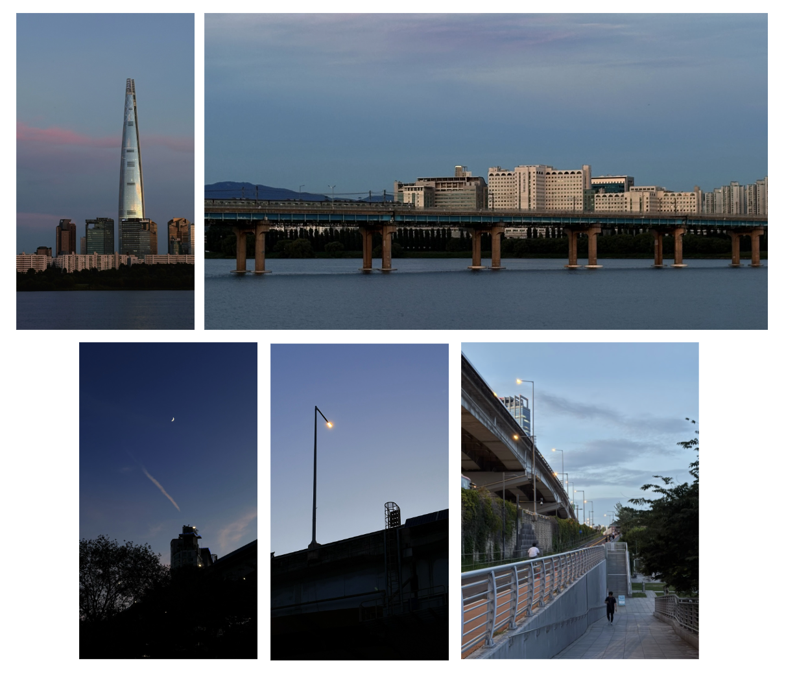
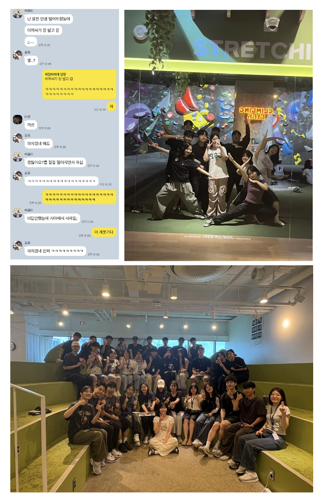
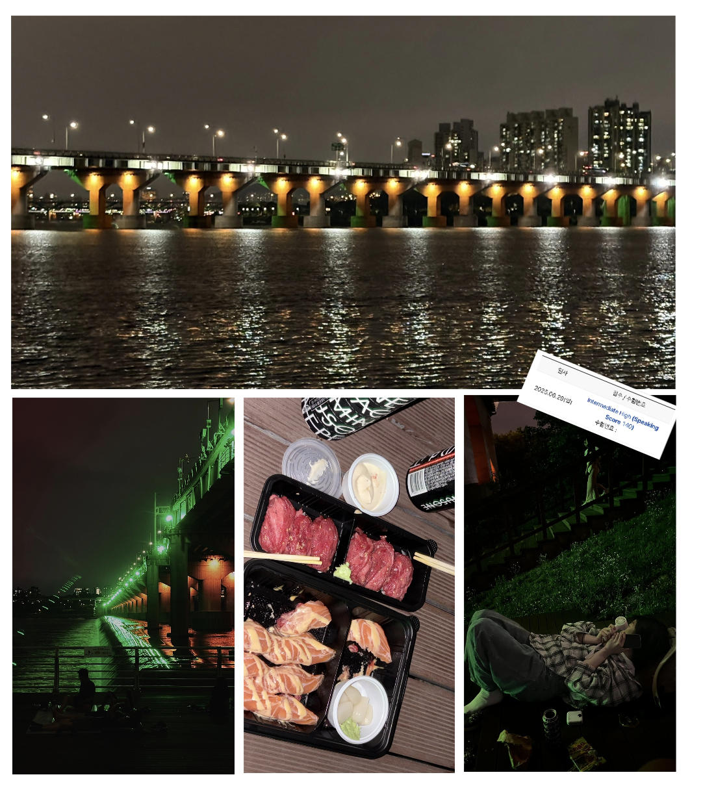
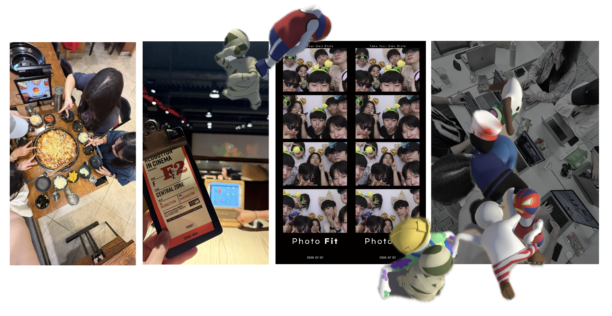
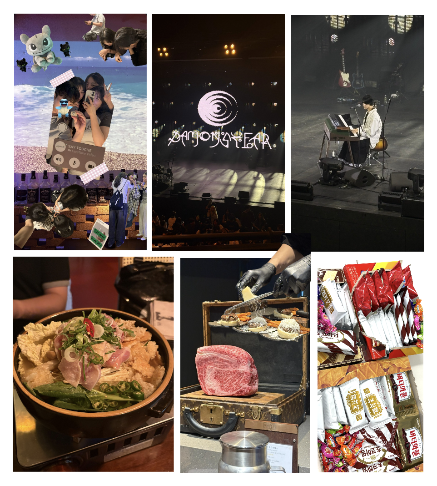

> 요약
>   2025년도 7월 셋째주 회고 글입니다.  
> 레벨3 스타또~~ 2주간의 회고를 진행합니다. 점점 경험하는 스펙트럼이 넓어져요

 

---

**목차**

- [🎵 오늘의 음악](#-오늘의-음악)
- [✔️ 다시 서울로](#️-다시-서울로)
- [🚩 레벨3 시작](#-레벨3-시작)
- [🧸 바쁜 일주일](#-바쁜-일주일)
  - [✔️ 또다시, 한강](#️-또다시-한강)
  - [✔️ 우테코의 보물](#️-우테코의-보물)
  - [✔️ 놀러다니기](#️-놀러다니기)

 

## 🎵 오늘의 음악

요즘엔 데이먼스 이어 노래가 정말 좋아요.

음이 너무 예쁘다. 몽환적인 노래를 좋아한다면 꼭 들어보는걸 추천합니다 :)

> **Josee!** - [ 데이먼스이어 ]

> 너는 달을 볼 때 눈이 커졌고  
> 나는 너의 눈에 비친 것을 보네  
> 네가 사랑하는 것이  
> 나와 같아  
> 나는 너를 보네
>
>  <iframe width="392" height="220" src="https://www.youtube.com/embed/qcUqqXqerp4" frameborder="0" allowfullscreen></iframe>

 

## ✔️ 다시 서울로

긴 방학을 마치고 다시 서울로 돌아오게 되었다.

아주 긴 시간은 아니였지만, 이제는 서울이 낯설게만 느껴지진 않는다. 조금은 익숙해진 걸지도 ㅎㅎ

사람이 너무너무 많아서 가끔은 지치기도 하고, 다들 너무 바쁘게 살아가는 서울이지만

그럼에도 불구하고 내가 서울을 좋아하게 된 이유를 꼽자면, 단연 **한강**이다.

시원한 여름 바람이 불 때 좋아하는 노래를 들으며 한강을 바라보고 있으면 그 시간이 마치 영원해질 것 같다.

몇 번을 보더라도 기분이 꽤 괜찮아지는 풍경이다.

한강이 너무 좋다.

 

## 🚩 레벨3 시작

방학이 끝났음을 슬퍼할 시간도 없이 레벨3이 시작되었다.

레벨 3부터는 캠퍼스가 바뀌는데, 랜덤으로 배정된다는 점 때문에 걱정이 많았다.

퐁쥬, 헤일리, 머핀과 거의 5개월을 함께 했던 터라, 떨어지기 싫었는데, 너무 매정하다 ㅠㅠㅠ

우리의 퐁퐁이는 혼자 선릉에 배정되어서 많이 속상해했다. 그래서 나도 너무 슬펑서 😢

사실 캠퍼스 배정에 신경을 쏟을 수 있을만큼 그렇게 정신있는 상황도 아니였지만

웨 헤어져야해 ㅠㅠㅠㅠㅠ

---

2주동안 있었던 일들을 간단히 돌아보자면,

곁에 너무 좋은 사람들이 많아서 정말 행복했다.

웃긴 일이든, 고민되는 일이든, 이상한 이야기든

마음놓고 얘기할 수 있는 사람들이 곁에 있어서 감사했다.

레벨 1,2때는 체력도 부족하고 마음의 여유도 없어서 많이 돌아다니지 못했는데, 레벨 3에 들어와서는 여유가 많이 생겼다.

클라이밍을 가기도 하고, 카페에서 애기하다 충동적으로 맥주 마시러 가기도 하고, 팀별 회식에 참여해서 잼얘를 듣기도 하고 하면서 꽤 재밌는 날들을 보내고 있다.

또 어느날은 프론트 + 안드로이드 크루 40명의 데일리미팅을 준비하기도 했다!!

40명이 즐길 수 있는 데일리미팅이 뭐있지? 하고 엄청 머리쥐어짜면서 고생했다.....

고민 끝에 "**스피드 물건 가져오기 게임**"을 기획하게 되었는데,

우테코 캠퍼스에 존재할수도 있지만 흔하지 않은 물건들을 팀별로 빠르게 가져오는 방식이었다.

예를들면 500원 동전, 손선풍기, 백엔드 크루 등등 ...

사람들이 너무 재밌게 잘 기획했다고 칭찬해줘서 뿌듯하기도 했고 사람들이 좋아해줘서 나도 기분이 너무 좋았다.

(사실 내가 센터인 사진이 있어서 기분이 좋았다 ㅎㅎ 은근 관심을 좋아해요)

 

## 🧸 바쁜 일주일

글을 적는 시점은 레벨3를 시작하고 2주가 지난 상황인데,

농담이 아니라 일주일에 5일이 약속이 잡혔다.

물론 약속을 일부러 잡고 나간것도 있긴한데, 그걸 제하더라도 그냥 충동적으로 놀러간 적이 꽤 많은 것 같다.

기억나는 몇가지만 정리해보자면,

 

### ✔️ 또다시, 한강

대숙이가 서울로 놀러왔다.

또 한강이냐 싶겠지만 또 한강이다. ㅎㅎ 나 한강 진짜 좋아해

연어 초밥이랑 육회 초밥을 포장해서 가서 먹었는데 너무 행복했다.

여름이지만 요새 바람이 많이 불어서 꽤 시원했던걸로 기억한다.

스시랑 함께 GD 하이볼을 처음 마셔봤는데, 진짜진짜진짜x100000 맛있다. 진짜 맛있다

나 웬만해선 큰 사이즈 캔 술은 다 안마시는데, GD 하이볼은 다 마셨다. 진짜 맛있다.

대숙이랑은 꽤 오래 본 사이라 큰 대화 없이 먹으면서 한강을 바라보기만 했는데도 너무 좋았다.

나중가서는 그냥 드러누웠다. 안누우려 했는데 눕지 않지 않을수가 없었다 ㅎㅎ

 

### ✔️ 우테코의 보물

우테코에서 가장 귀한게 먼지 아시려나~~

**사람들이, 크루들이 너무 좋다. 너무 귀하다. 너무 값진 사람들이다**

글 적다보니 점점 양이 늘어나는데 ㅋㅋㅋ 지금도 내 앞에서 클레어씨랑 얘기중인 헤일리가 보인다.

계속해서 나오는 그 이름들 ,,, 헤일리 머핀 퐁쥬..

그녀들과 CGV 보겜카 가서 한바탕 하고 못다한 이야기들도 많이 했다.

그리고 나의 삶에 들어온, 앞으로 4개월을 함께할 나의 NEW 보물들을 소개한다.

분주, 우디, 윌슨, 웨이드, 폰트, 젠슨

함께 하기에 너무나도 좋은 사람들이고, 만나게 되어서 감사하고. 또 계속 같이 있고싶은 사람들이다.

다같이 휴먼펄플랫(머리끄댕이잡기게임)을 하면서 친해지고, 회식도 하고, 시간이 갈수록 더 친해지고 싶은 사람들이다.

팀플하면서 놀랬던점은 ~ 나랑 우디빼고 다 T였다.. !

사실 나도 F이긴 하지만, 작업이나 일할 때는 T적인 모습이 많이 나와서 가끔은 조심해야 할 부분이 많은 것 같다.

 

### ✔️ 놀러다니기

허허 이렇게 보니까 정말 많이 놀러다닌 것 같다.

밑에 사진도 한 3-4일치 사진 요약해둔거다.

서울은 놀거리가 참 많다. 맛집도 많고. 가고싶은곳도 많다.

데이먼스이어 콘서트를 가기도하고, 성수동을 돌아다니기도 했다.

그리고 내가 알기로, 우테코 사람들도 정말 잘 논다.

항상 어디든 돌아다니고 놀러다니고. 서울 온 김에 못해본거 거의 다 뽕뽑고 가는 느낌 ㅋㅋㅋㅋㅋㅋ

열심히 공부하는 것도 정말 중요한데, 그만큼 잘 놀고 스트레스를 잘 해결하는 방법이 정말 중요한 것 같다.

나의 강점 중 하나는 **회복탄력성이 되게 높다.**

스트레스를 풀 수 있는 요소가 정말정말 다양해서

속상하고 화가나면 울기도 하고, 얘기도 하면서 풀 수 있고

스트레스가 쌓이거나 혼자있고싶을땐 게임을 한다거나, 그림을 그린다거나, 런닝을 뛰고 온다거나, 넷플릭스를 본다거나, 잠을 자거나, 맛있는걸 먹거나, 전화를 하거나, 묵상을 하거나 ...

하나에 의존적으로 지내지 않아서 넘어지더라도 오래 머무르지 않을 수 있는 것 같다.

